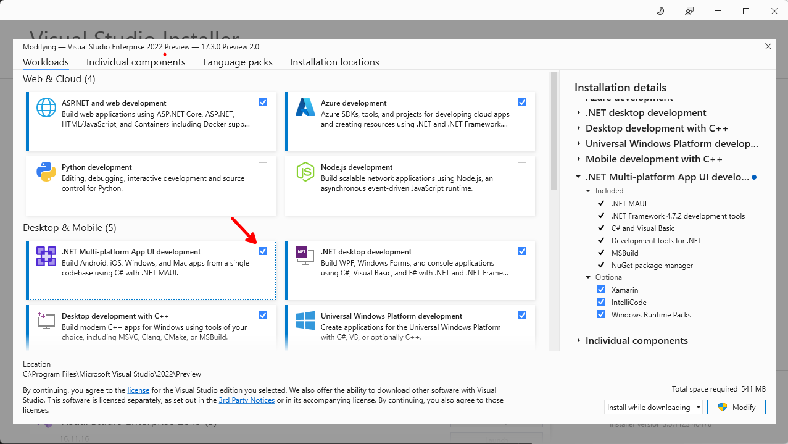

# Table of Contents

- [Table of Contents](#table-of-contents)
  - [Introduction](#introduction)
  - [Prerequisites](#prerequisites)
    - [.NET 6.0](#net-60)
    - [Visual Studio 2022 Preview](#visual-studio-2022-preview)
    - [Mobile Development with .NET Workload](#mobile-development-with-net-workload)
    - [FREE Xamarin UI Controls](#free-xamarin-ui-controls)
  - [Demo](#demo)
  - [Summary](#summary)
  - [Complete Code](#complete-code)
  - [Resources](#resources)

## Introduction

In this episode we are going to take the .NET Rocks! Xamarin Forms app built in [Building a Mobile Podcast App Pt 7: The .NET Show with Carl Franklin Ep 9](https://www.youtube.com/watch?v=NC1xDdy5z1o&list=PL8h4jt35t1wgW_PqzZ9USrHvvnk8JMQy_&index=9), and convert it to a MAUI application.

You can find the starting point in this repo: [MobileDnr7](https://github.com/carlfranklin/MobileDnr7) at https://github.com/carlfranklin/MobileDnr7

## Prerequisites

The following prerequisites are needed for this demo.

### .NET 6.0

Download the latest version of the .NET 6.0 SDK [here](https://dotnet.microsoft.com/en-us/download).

### Visual Studio 2022 Preview

For this demo, we are going to use the latest version of [Visual Studio 2022 Preview](https://visualstudio.microsoft.com/vs/community/).

### Mobile Development with .NET Workload

In order to build a .NET Multi-platform App UI (MAUI) application, the .NET Multi-platform App UI development  workload needs to be installed, so if you do not have that installed let's do that now.

  

### FREE Xamarin UI Controls

The .NET Rocks! Xamarin Forms application uses the free Xamarin UI Controls from [DevExpress](https://www.devexpress.com/), which you can find [here](https://www.devexpress.com/xamarin/).

## Demo

## Summary

## Complete Code

The complete code for this demo can be found in the link below.

- <https://github.com/payini/XamarinToMaui>

## Resources

| Resource Title                                                            | Url                                                                                           |
| ------------------------------------------------------------------------- | --------------------------------------------------------------------------------------------- |
| The .NET Show with Carl Franklin                                          | <https://www.youtube.com/playlist?list=PL8h4jt35t1wgW_PqzZ9USrHvvnk8JMQy_>                    |
| Building a Mobile Podcast App Pt 7: The .NET Show with Carl Franklin Ep 9 | <https://www.youtube.com/watch?v=NC1xDdy5z1o&list=PL8h4jt35t1wgW_PqzZ9USrHvvnk8JMQy_&index=9> |
| FREE Xamarin UI Controls                                                  | <https://www.devexpress.com/xamarin/>                                                         |
| MobileDnr7                                                                | <https://github.com/carlfranklin/MobileDnr7>                                                  |
| Download .NET                                                             | <https://dotnet.microsoft.com/en-us/download>                                                 |
