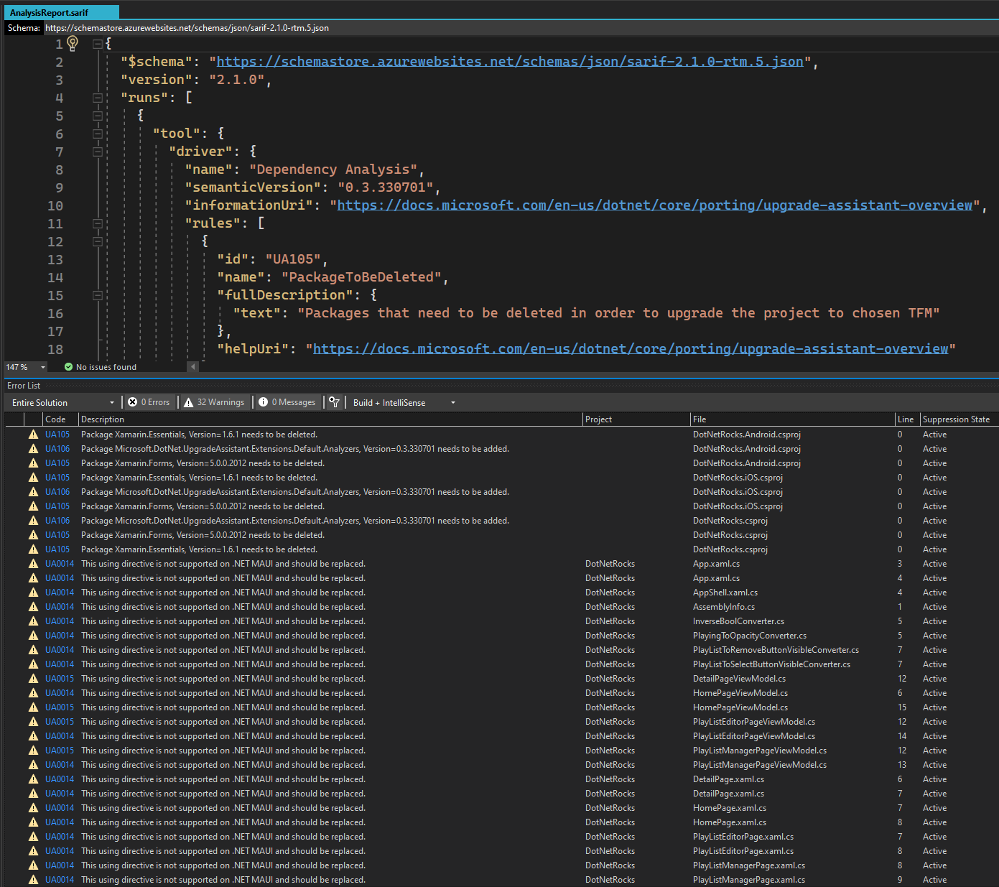

# Table of Contents

- [Table of Contents](#table-of-contents)
  - [Introduction](#introduction)
  - [Prerequisites](#prerequisites)
    - [.NET 6 SDK](#net-6-sdk)
    - [.NET Upgrade Assistant](#net-upgrade-assistant)
    - [Visual Studio 2022 Preview](#visual-studio-2022-preview)
    - [Mobile Development with .NET Workload](#mobile-development-with-net-workload)
    - [FREE Xamarin UI Controls](#free-xamarin-ui-controls)
  - [Demo](#demo)
    - [SARIF Viewer Visual Studio Extension](#sarif-viewer-visual-studio-extension)
    - [SARIF Viewer VS Code Extension](#sarif-viewer-vs-code-extension)
  - [Summary](#summary)
  - [Complete Code](#complete-code)
  - [Resources](#resources)

## Introduction

In this episode we are going to take the .NET Rocks! Xamarin Forms app built in [Building a Mobile Podcast App Pt 7: The .NET Show with Carl Franklin Ep 9](https://www.youtube.com/watch?v=NC1xDdy5z1o&list=PL8h4jt35t1wgW_PqzZ9USrHvvnk8JMQy_&index=9), and convert it to a MAUI application.

You can find the starting point in this repo: [MobileDnr7](https://github.com/carlfranklin/MobileDnr7) at https://github.com/carlfranklin/MobileDnr7

## Prerequisites

The following prerequisites are needed for this demo.

### .NET 6 SDK

Download the latest version of the .NET 6 SDK [here](https://dotnet.microsoft.com/en-us/platform/upgrade-assistant/tutorial/install-sdk).

### .NET Upgrade Assistant

Get started information for the `upgrade-assistant` can be found [here](https://dotnet.microsoft.com/en-us/platform/upgrade-assistant/tutorial/install-upgrade-assistant).

### Visual Studio 2022 Preview

For this demo, we are going to use the latest version of [Visual Studio 2022 Preview](https://visualstudio.microsoft.com/vs/community/).

### Mobile Development with .NET Workload

In order to build a .NET Multi-platform App UI (MAUI) application, the .NET Multi-platform App UI development  workload needs to be installed, so if you do not have that installed let's do that now.

  

### FREE Xamarin UI Controls

The .NET Rocks! Xamarin Forms application uses the free Xamarin UI Controls from [DevExpress](https://www.devexpress.com/), which you can find [here](https://www.devexpress.com/xamarin/).

## Demo

According to [Migrate your app from Xamarin.Forms](https://docs.microsoft.com/en-us/dotnet/maui/get-started/migrate), in order to convert a Xamarin Forms app to MAUI you need to accomplish two things:

1. Migrate the Xamarin Forms app to .NET 6.
2. Update the code to .NET MAUI.

In order to accomplish the two steps above, the following basic actions need to be completed:

- Convert the projects from .NET Framework to .NET SDK style.
- Update namespaces.
- Update any incompatible NuGet packages.
- Address any breaking API changes.
- Run the converted app and verify that it functions correctly.

Luckily, Microsoft is working on the [.NET Upgrade Assistant](https://dotnet.microsoft.com/en-us/platform/upgrade-assistant), which provides a good head-start, however some steps may need to be performed manually.

>:blue_book: At the time of this writing, the .NET Upgrade Assistant is still in Preview and not complete. For more information check this link [Migrating from Xamarin.Forms (Preview)](https://github.com/dotnet/maui/wiki/Migrating-from-Xamarin.Forms-(Preview))

But first, let's start by making sure our Xamarin Forms app builds and run successfully.

  

  

Now that we verified tha application builds and run successfully, let's work on the upgrade.

Download the `upgrade-assistant` tool using the **dotnet** executable:

```dotnetcli
dotnet tool install -g --add-source 'https://api.nuget.org/v3/index.json' --ignore-failed-sources upgrade-assistant

You can invoke the tool using the following command: upgrade-assistant
Tool 'upgrade-assistant' (version '0.3.330701') was successfully installed.
```

The 'upgrade-assistant' has a dry-run feature called `analyze`, let's run that first to see that it outputs. Open the `Windows Terminal` or `Command Prompt`, CD into the folder where you checked-out the code, where the **MobileDnr.sln** is. Then run the following command:

```dotnetcli
upgrade-assistant analyze .\MobileDnr.sln

-----------------------------------------------------------------------------------------------------------------
Microsoft .NET Upgrade Assistant v0.3.330701+fa00bab2d06aab9c710c344c0f32440ad4eb8410

We are interested in your feedback! Please use the following link to open a survey: https://aka.ms/DotNetUASurvey
-----------------------------------------------------------------------------------------------------------------

[22:00:46 INF] Loaded 7 extensions
[22:00:49 INF] Using MSBuild from C:\Program Files\dotnet\sdk\6.0.400-preview.22301.10\
[22:00:49 INF] Using Visual Studio install from C:\Program Files\Microsoft Visual Studio\2022\Preview [v17]
[22:00:49 ERR] Unexpected error
Autofac.Core.DependencyResolutionException: An exception was thrown while activating Microsoft.DotNet.UpgradeAssistant.MSBuild.MSBuildWorkspaceUpgradeContext.
 ---> Autofac.Core.DependencyResolutionException: An exception was thrown while invoking the constructor 'Void .ctor(Microsoft.Extensions.Options.IOptions`1[Microsoft.DotNet.UpgradeAssistant.MSBuild.WorkspaceOptions], Microsoft.DotNet.UpgradeAssistant.MSBuild.Factories, System.Func`3[Microsoft.DotNet.UpgradeAssistant.MSBuild.MSBuildWorkspaceUpgradeContext,System.IO.FileInfo,Microsoft.DotNet.UpgradeAssistant.MSBuild.MSBuildProject], Microsoft.Extensions.Logging.ILogger`1[Microsoft.DotNet.UpgradeAssistant.MSBuild.MSBuildWorkspaceUpgradeContext])' on type 'MSBuildWorkspaceUpgradeContext'.
 ---> System.IO.FileLoadException: Could not load file or assembly 'System.Configuration.ConfigurationManager, Version=6.0.0.0, Culture=neutral, PublicKeyToken=cc7b13ffcd2ddd51'. Could not find or load a specific file. (0x80131621)
File name: 'System.Configuration.ConfigurationManager, Version=6.0.0.0, Culture=neutral, PublicKeyToken=cc7b13ffcd2ddd51'
 ---> System.IO.FileLoadException: Could not load file or assembly 'System.Configuration.ConfigurationManager, Version=6.0.0.0, Culture=neutral, PublicKeyToken=cc7b13ffcd2ddd51'.
   at System.Runtime.Loader.AssemblyLoadContext.LoadFromPath(IntPtr ptrNativeAssemblyLoadContext, String ilPath, String niPath, ObjectHandleOnStack retAssembly)
   ...
   ConsoleRunner.cs:line 61
```

>:point_up: Output is trimmed for simplicity.

As you can see, the current `upgrade-assistant` is throwing up an exception. According to an open GitHub [issue](https://github.com/dotnet/upgrade-assistant/issues/1187), this may be happening because of the preview versions of Visual Studio and MSBuild.

 >:blue_note: The `upgrade-assistant` will use the latest version of MSBuild and Visual Studio, if not provided in the options. Since we are using `Visual Studio 2022 Preview` a preview version of MSBuild will be used, which throws the exception.

Worry not, we can work-around this issue by providing the `--msbuild-path <msbuild-path>` option. Re-run the command like this:

```dotnetcli
 upgrade-assistant analyze .\MobileDnr.sln --msbuild-path "C:\Program Files\dotnet\sdk\6.0.301\"
-----------------------------------------------------------------------------------------------------------------
Microsoft .NET Upgrade Assistant v0.3.330701+fa00bab2d06aab9c710c344c0f32440ad4eb8410

We are interested in your feedback! Please use the following link to open a survey: https://aka.ms/DotNetUASurvey
-----------------------------------------------------------------------------------------------------------------

[22:16:00 INF] Loaded 7 extensions
[22:16:01 INF] Using MSBuild from C:\Program Files\dotnet\sdk\6.0.301\
[22:16:01 INF] Using Visual Studio install from C:\Program Files\Microsoft Visual Studio\2022\Preview [v17]
[22:16:04 INF] Writing output to Y:\XamarinToMaui\AnalysisReport.sarif
[22:16:04 INF] Project DotNetRocks.Android.csproj is of type Xamarin.Android, migration to .NET MAUI requires to be least net6.0-android.
[22:16:04 INF] Marking package Xamarin.Forms for removal based on package mapping configuration Xamarin Legacy Packages
[22:16:04 INF] Marking package Xamarin.Essentials for removal based on package mapping configuration Xamarin Legacy Packages
[22:16:06 INF] Reference to .NET Upgrade Assistant analyzer package (Microsoft.DotNet.UpgradeAssistant.Extensions.Default.Analyzers, version 0.3.330701) needs to be added
[22:16:06 INF] Recommending executable TFM net6.0 because the project builds to an executable
[22:16:06 INF] Project DotNetRocks.iOS.csproj is of type Xamarin.iOS, migration to .NET MAUI requires to be least net6.0-ios.
[22:16:06 INF] Marking package Xamarin.Forms for removal based on package mapping configuration Xamarin Legacy Packages
[22:16:06 INF] Marking package Xamarin.Essentials for removal based on package mapping configuration Xamarin Legacy Packages
[22:16:08 INF] Reference to .NET Upgrade Assistant analyzer package (Microsoft.DotNet.UpgradeAssistant.Extensions.Default.Analyzers, version 0.3.330701) needs to be added
[22:16:08 INF] Skip minimum dependency check because .NET MAUI support multiple TFMs.
[22:16:08 INF] Project DotNetRocks.csproj is of type .NET MAUI Target: MAUI head, migration to .NET MAUI requires to be multiplatform
[22:16:08 INF] Marking package Xamarin.Forms for removal based on package mapping configuration Xamarin Legacy Packages
[22:16:08 INF] Marking package Xamarin.Essentials for removal based on package mapping configuration Xamarin Legacy Packages
[22:16:09 INF] Reference to .NET Upgrade Assistant analyzer package (Microsoft.DotNet.UpgradeAssistant.Extensions.Default.Analyzers, version 0.3.330701) needs to be added
[22:16:09 INF] Running analyzers on DotNetRocks.Android
[22:16:39 INF] Identified 0 diagnostics in project DotNetRocks.Android
[22:16:39 INF] Running analyzers on DotNetRocks.iOS
[22:16:40 INF] Identified 0 diagnostics in project DotNetRocks.iOS
[22:16:40 INF] Running analyzers on DotNetRocks
[22:16:41 INF] Identified 23 diagnostics in project DotNetRocks
[22:16:41 INF] Diagnostic UA0014 with the message This using directive is not supported on .NET MAUI and should be replaced. generated
[22:16:41 INF] Diagnostic UA0014 with the message This using directive is not supported on .NET MAUI and should be replaced. generated
[22:16:41 INF] Diagnostic UA0014 with the message This using directive is not supported on .NET MAUI and should be replaced. generated
[22:16:41 INF] Diagnostic UA0014 with the message This using directive is not supported on .NET MAUI and should be replaced. generated
[22:16:41 INF] Diagnostic UA0014 with the message This using directive is not supported on .NET MAUI and should be replaced. generated
[22:16:41 INF] Diagnostic UA0014 with the message This using directive is not supported on .NET MAUI and should be replaced. generated
[22:16:41 INF] Diagnostic UA0014 with the message This using directive is not supported on .NET MAUI and should be replaced. generated
[22:16:41 INF] Diagnostic UA0014 with the message This using directive is not supported on .NET MAUI and should be replaced. generated
[22:16:41 INF] Diagnostic UA0014 with the message This using directive is not supported on .NET MAUI and should be replaced. generated
[22:16:41 INF] Diagnostic UA0015 with the message This using directive is not supported on .NET MAUI and should be replaced. generated
[22:16:41 INF] Diagnostic UA0014 with the message This using directive is not supported on .NET MAUI and should be replaced. generated
[22:16:41 INF] Diagnostic UA0015 with the message This using directive is not supported on .NET MAUI and should be replaced. generated
[22:16:41 INF] Diagnostic UA0014 with the message This using directive is not supported on .NET MAUI and should be replaced. generated
[22:16:41 INF] Diagnostic UA0015 with the message This using directive is not supported on .NET MAUI and should be replaced. generated
[22:16:41 INF] Diagnostic UA0014 with the message This using directive is not supported on .NET MAUI and should be replaced. generated
[22:16:41 INF] Diagnostic UA0014 with the message This using directive is not supported on .NET MAUI and should be replaced. generated
[22:16:41 INF] Diagnostic UA0014 with the message This using directive is not supported on .NET MAUI and should be replaced. generated
[22:16:41 INF] Diagnostic UA0014 with the message This using directive is not supported on .NET MAUI and should be replaced. generated
[22:16:41 INF] Diagnostic UA0014 with the message This using directive is not supported on .NET MAUI and should be replaced. generated
[22:16:41 INF] Diagnostic UA0014 with the message This using directive is not supported on .NET MAUI and should be replaced. generated
[22:16:41 INF] Diagnostic UA0014 with the message This using directive is not supported on .NET MAUI and should be replaced. generated
[22:16:41 INF] Diagnostic UA0014 with the message This using directive is not supported on .NET MAUI and should be replaced. generated
[22:16:41 INF] Diagnostic UA0015 with the message This using directive is not supported on .NET MAUI and should be replaced. generated
[22:16:41 INF] Analysis Complete, the report is available at Y:\XamarinToMaui\AnalysisReport.sarif
```

The command runs successfully now, and generates two files **AnalysisReport.sarif**, which is a JSON file with the analysis results, and **upgrade-assistant.clef** which contains debug information, related to the code analyzed, which provides a great experience, since clicking on each of the results, will take you directly to the specific code that needs to be changed.

To be able to work with a SARIF file, we need a SARIF Viewer. I will show you two, one for Visual Studio, and one for VS Code.

>:blue_note: SARIF (Static Analysis Results Interchange Format,) defines a standard format for the output of static analysis tools. You can see the SARIF specification document [here](https://docs.oasis-open.org/sarif/sarif/v2.0/sarif-v2.0.html)

### SARIF Viewer Visual Studio Extension

Go to `Extensions/Manage Extensions` and search for sarif, install the extension, and re-start Visual Studio.

  

Open the **AnalysisReport.sarif** file from `Tools/Open Static Analysis Results as SARIF`

  

This will open the file as JSON, but if you look at the `Errors List` windows, you will see the results, with everything needed for the upgrade.

  

Great, only warnings, and no errors.

The great thing about the extension, is that if you double-click on some of the errors, Visual Studio will take you to the file in question.

  

### SARIF Viewer VS Code Extension

Let's now try the VS Code SARIF Viewer Extension. This step is optional, and you can skip it if you want.

Open the VS Code Extensions `(Ctrl+Shift+X)` and type `sarif`, to install the SARIF Viewer VS Code Extension.

  

Open the **AnalysisReport.sarif** file and see the nicely grouped results on the right side:

  

You can expand the grouped results, and clicking on some of the results, will take you to the code file needing the specific changes:

  

Now that we know what the `upgrade-assistant` is going to do, let's run the command for real:

```dotnetcli
 upgrade-assistant upgrade .\MobileDnr.sln --msbuild-path "C:\Program Files\dotnet\sdk\6.0.301\"
-----------------------------------------------------------------------------------------------------------------
Microsoft .NET Upgrade Assistant v0.3.330701+fa00bab2d06aab9c710c344c0f32440ad4eb8410

We are interested in your feedback! Please use the following link to open a survey: https://aka.ms/DotNetUASurvey
-----------------------------------------------------------------------------------------------------------------

[22:55:40 INF] Loaded 7 extensions
[22:55:41 INF] Using MSBuild from C:\Program Files\dotnet\sdk\6.0.301\
[22:55:41 INF] Using Visual Studio install from C:\Program Files\Microsoft Visual Studio\2022\Preview [v17]
[22:55:44 INF] Initializing upgrade step Select an entrypoint

Upgrade Steps

1. [Next step] Select an entrypoint
2. Select project to upgrade

Choose a command:
   1. Apply next step (Select an entrypoint)
   2. Skip next step (Select an entrypoint)
   3. See more step details
   4. Configure logging
   5. Exit
>
```

This time you are presented with a menu.

>:blue_book: At any step, you can see more details about the step to be performed by selecting `3. See more step details`. Let's do that before continuing with step 1.

```dotnetcli
> 3
--------------------
Select an entrypoint
--------------------
The entrypoint is the application you run or the library that is to be upgraded. Dependencies will then be analyzed
and a recommended process will then be determined
  Status              : Incomplete
  Risk to break build : None
  Details             : No entrypoint was selected. Solutions require an entrypoint to proceed.
Please press enter to continue...
```

Now that we know, let's chose step 1.

```dotnetcli
> 1
[23:01:36 INF] Applying upgrade step Select an entrypoint
Please select the project you run. We will then analyze the dependencies and identify the recommended order to upgrade projects.
   1. DotNetRocks
   2. DotNetRocks.Android
   3. DotNetRocks.iOS
>
```

Select number 1.

```dotnetcli
> 1
[23:02:20 INF] Upgrade step Select an entrypoint applied successfully
Please press enter to continue...
```

Press enter to continue.

```dotnetcli
[23:02:20 INF] Upgrade step Select an entrypoint applied successfully
Please press enter to continue...

[23:02:43 INF] Initializing upgrade step Select project to upgrade
[23:02:43 INF] Skip minimum dependency check because .NET MAUI support multiple TFMs.
[23:02:43 INF] Project DotNetRocks.csproj is of type .NET MAUI Target: MAUI head, migration to .NET MAUI requires to be multiplatform
[23:02:43 INF] Skip minimum dependency check because .NET MAUI support multiple TFMs.
[23:02:43 INF] Project DotNetRocks.csproj is of type .NET MAUI Target: MAUI head, migration to .NET MAUI requires to be multiplatform
[23:02:43 INF] Initializing upgrade step Back up project

Upgrade Steps

Entrypoint: Y:\XamarinToMaui\DotNetRocks\DotNetRocks\DotNetRocks.csproj
Current Project: Y:\XamarinToMaui\DotNetRocks\DotNetRocks\DotNetRocks.csproj

1. [Next step] Back up project
2. Convert project file to SDK style
3. Add TargetFramework for .NET MAUI Project
4. Clean up NuGet package references
    a. Duplicate reference analyzer
    b. Package map reference analyzer
    c. Target compatibility reference analyzer
    d. Upgrade assistant reference analyzer
    e. Windows Compatibility Pack Analyzer
    f. MyDotAnalyzer reference analyzer
    g. Newtonsoft.Json reference analyzer
    h. Windows App SDK package analysis
    i. Transitive reference analyzer
5. Update TFM
6. Update NuGet Packages
    a. Duplicate reference analyzer
    b. Package map reference analyzer
    c. Target compatibility reference analyzer
    d. Upgrade assistant reference analyzer
    e. Windows Compatibility Pack Analyzer
    f. MyDotAnalyzer reference analyzer
    g. Newtonsoft.Json reference analyzer
    h. Windows App SDK package analysis
    i. Transitive reference analyzer
7. Add Project Properties for .NET MAUI Project
8. Add template files
9. Update source code
    a. Apply fix for UA0002: Types should be upgraded
    b. Apply fix for UA0012: 'UnsafeDeserialize()' does not exist
    c. Apply fix for UA0014: .NET MAUI projects should not reference Xamarin.Forms namespaces
    d. Apply fix for UA0015: .NET MAUI projects should not reference Xamarin.Essentials namespaces
10. Move to next project

Choose a command:
   1. Apply next step (Back up project)
   2. Skip next step (Back up project)
   3. See more step details
   4. Select different project
   5. Configure logging
   6. Exit
>
```

Since we are performing the steps from a source-controlled repo, we do not really need a backup, as we can always do that from source control. Let's skip step 1. [Next step] Back up project. Type 2, and press enter.

```dotnetcli
> 2
[23:19:02 INF] Skipping upgrade step Back up project
[23:19:02 INF] Upgrade step Back up project skipped
Please press enter to continue...

[23:19:09 INF] Initializing upgrade step Convert project file to SDK style
[23:19:09 INF] Initializing upgrade step Add TargetFramework for .NET MAUI Project
[23:19:09 INF] TFM needs updated to .NET MAUI TFMs

Upgrade Steps

Entrypoint: Y:\XamarinToMaui\DotNetRocks\DotNetRocks\DotNetRocks.csproj
Current Project: Y:\XamarinToMaui\DotNetRocks\DotNetRocks\DotNetRocks.csproj

1. [Skipped] Back up project
2. [Complete] Convert project file to SDK style
3. [Next step] Add TargetFramework for .NET MAUI Project
4. Clean up NuGet package references
    a. Duplicate reference analyzer
    b. Package map reference analyzer
    c. Target compatibility reference analyzer
    d. Upgrade assistant reference analyzer
    e. Windows Compatibility Pack Analyzer
    f. MyDotAnalyzer reference analyzer
    g. Newtonsoft.Json reference analyzer
    h. Windows App SDK package analysis
    i. Transitive reference analyzer
5. Update TFM
6. Update NuGet Packages
    a. Duplicate reference analyzer
    b. Package map reference analyzer
    c. Target compatibility reference analyzer
    d. Upgrade assistant reference analyzer
    e. Windows Compatibility Pack Analyzer
    f. MyDotAnalyzer reference analyzer
    g. Newtonsoft.Json reference analyzer
    h. Windows App SDK package analysis
    i. Transitive reference analyzer
7. Add Project Properties for .NET MAUI Project
8. Add template files
9. Update source code
    a. Apply fix for UA0002: Types should be upgraded
    b. Apply fix for UA0012: 'UnsafeDeserialize()' does not exist
    c. Apply fix for UA0014: .NET MAUI projects should not reference Xamarin.Forms namespaces
    d. Apply fix for UA0015: .NET MAUI projects should not reference Xamarin.Essentials namespaces
10. Move to next project

Choose a command:
   1. Apply next step (Add TargetFramework for .NET MAUI Project)
   2. Skip next step (Add TargetFramework for .NET MAUI Project)
   3. See more step details
   4. Select different project
   5. Configure logging
   6. Exit
```

Notice `2. [Complete] Convert project file to SDK style`, we just converted the .NET Framework to .NET SDK style.

Let's continue with step 3. Add TargetFramework for .NET MAUI Project. Type 3 and press enter twice.

```dotnetcli
> 3
-----------------------------------------
Add TargetFramework for .NET MAUI Project
-----------------------------------------
Add Platform TargetFramework for XamarinForms projects being converted
  Status              : Incomplete
  Risk to break build : High
  Details             : TFM needs to be updated to .NET MAUI Targetframeworks
Please press enter to continue...


Upgrade Steps

Entrypoint: Y:\XamarinToMaui\DotNetRocks\DotNetRocks\DotNetRocks.csproj
Current Project: Y:\XamarinToMaui\DotNetRocks\DotNetRocks\DotNetRocks.csproj

1. [Skipped] Back up project
2. [Complete] Convert project file to SDK style
3. [Next step] Add TargetFramework for .NET MAUI Project
4. Clean up NuGet package references
    a. Duplicate reference analyzer
    b. Package map reference analyzer
    c. Target compatibility reference analyzer
    d. Upgrade assistant reference analyzer
    e. Windows Compatibility Pack Analyzer
    f. MyDotAnalyzer reference analyzer
    g. Newtonsoft.Json reference analyzer
    h. Windows App SDK package analysis
    i. Transitive reference analyzer
5. Update TFM
6. Update NuGet Packages
    a. Duplicate reference analyzer
    b. Package map reference analyzer
    c. Target compatibility reference analyzer
    d. Upgrade assistant reference analyzer
    e. Windows Compatibility Pack Analyzer
    f. MyDotAnalyzer reference analyzer
    g. Newtonsoft.Json reference analyzer
    h. Windows App SDK package analysis
    i. Transitive reference analyzer
7. Add Project Properties for .NET MAUI Project
8. Add template files
9. Update source code
    a. Apply fix for UA0002: Types should be upgraded
    b. Apply fix for UA0012: 'UnsafeDeserialize()' does not exist
    c. Apply fix for UA0014: .NET MAUI projects should not reference Xamarin.Forms namespaces
    d. Apply fix for UA0015: .NET MAUI projects should not reference Xamarin.Essentials namespaces
10. Move to next project

Choose a command:
   1. Apply next step (Add TargetFramework for .NET MAUI Project)
   2. Skip next step (Add TargetFramework for .NET MAUI Project)
   3. See more step details
   4. Select different project
   5. Configure logging
   6. Exit
```

Now type 1 and hit enter.

```dotnetcli
> 1
[23:26:39 INF] Applying upgrade step Add TargetFramework for .NET MAUI Project
[23:26:39 INF] Removing Project Property: TargetFramework Value : netstandard2.0
[23:26:39 INF] Added TFMs to .NET MAUI project
[23:26:43 INF] Upgrade step Add TargetFramework for .NET MAUI Project applied successfully
Please press enter to continue...
```

Please press enter to continue.

```dotnetcli
[23:27:15 INF] Initializing upgrade step Clean up NuGet package references
[23:27:15 INF] Initializing upgrade step Duplicate reference analyzer
[23:27:15 INF] No package updates needed
[23:27:15 INF] Initializing upgrade step Package map reference analyzer
[23:27:15 INF] Marking package Xamarin.Forms for removal based on package mapping configuration Xamarin Legacy Packages
[23:27:15 INF] Marking package Xamarin.Essentials for removal based on package mapping configuration Xamarin Legacy Packages
[23:27:15 INF] Initializing upgrade step Remove package 'Xamarin.Forms'

Upgrade Steps

Entrypoint: Y:\XamarinToMaui\DotNetRocks\DotNetRocks\DotNetRocks.csproj
Current Project: Y:\XamarinToMaui\DotNetRocks\DotNetRocks\DotNetRocks.csproj

1. [Skipped] Back up project
2. [Complete] Convert project file to SDK style
3. [Complete] Add TargetFramework for .NET MAUI Project
4. Clean up NuGet package references
    a. [Complete] Duplicate reference analyzer
    b. Package map reference analyzer
        1. [Next step] Remove package 'Xamarin.Forms'
        2. Remove package 'Xamarin.Essentials'
    c. Target compatibility reference analyzer
    d. Upgrade assistant reference analyzer
    e. Windows Compatibility Pack Analyzer
    f. MyDotAnalyzer reference analyzer
    g. Newtonsoft.Json reference analyzer
    h. Windows App SDK package analysis
    i. Transitive reference analyzer
5. Update TFM
6. Update NuGet Packages
    a. Duplicate reference analyzer
    b. Package map reference analyzer
    c. Target compatibility reference analyzer
    d. Upgrade assistant reference analyzer
    e. Windows Compatibility Pack Analyzer
    f. MyDotAnalyzer reference analyzer
    g. Newtonsoft.Json reference analyzer
    h. Windows App SDK package analysis
    i. Transitive reference analyzer
7. Add Project Properties for .NET MAUI Project
8. Add template files
9. Update source code
    a. Apply fix for UA0002: Types should be upgraded
    b. Apply fix for UA0012: 'UnsafeDeserialize()' does not exist
    c. Apply fix for UA0014: .NET MAUI projects should not reference Xamarin.Forms namespaces
    d. Apply fix for UA0015: .NET MAUI projects should not reference Xamarin.Essentials namespaces
10. Move to next project

Choose a command:
   1. Apply next step (Remove package 'Xamarin.Forms')
   2. Skip next step (Remove package 'Xamarin.Forms')
   3. See more step details
   4. Select different project
   5. Configure logging
   6. Exit
```

At this point, we get the hang of it, we have an Skipped step, three Complete steps, and one Next step:


Let's continue the process until we complete all the steps. It becomes an easy process, basically select step 1, press enter twice, and repeat. Let's do that until we finished all steps.

Eventually, you will be done with project 1.


If you have more projects to covert, you can do that next, but in this demo, there is nothing else to convert, so selecting 1. Apply next step (Move to next project), will do nothing, and you will be presented to the 1. Apply next step (Finalize upgrade), which you will select to finish the upgrade.

```dotnetcli
10. [Next step] Move to next project

Choose a command:
   1. Apply next step (Move to next project)
   2. Skip next step (Move to next project)
   3. See more step details
   4. Select different project
   5. Configure logging
   6. Exit
> 1
[23:34:26 INF] Applying upgrade step Move to next project
[23:34:26 INF] Upgrade step Move to next project applied successfully
Please press enter to continue...

[23:34:30 INF] Initializing upgrade step Select project to upgrade
[23:34:30 INF] Skip minimum dependency check because .NET MAUI support multiple TFMs.
[23:34:30 INF] Project DotNetRocks.csproj is of type .NET MAUI Target:Android, migration to .NET MAUI requires to be least net6.0-android.
[23:34:30 INF] Project DotNetRocks.csproj is of type .NET MAUI Target:iOS, migration to .NET MAUI requires to be least net6.0-ios.
[23:34:30 WRN] Could not merge incoming TFM update from net6.0-android to net6.0-ios
[23:34:30 INF] No projects need upgraded for selected entrypoint
[23:34:30 INF] Initializing upgrade step Finalize upgrade

Upgrade Steps

Entrypoint: Y:\XamarinToMaui\DotNetRocks\DotNetRocks\DotNetRocks.csproj

1. Select project to upgrade
2. [Next step] Finalize upgrade

Choose a command:
   1. Apply next step (Finalize upgrade)
   2. Skip next step (Finalize upgrade)
   3. See more step details
   4. Configure logging
   5. Exit
> 1
[23:34:45 INF] Applying upgrade step Finalize upgrade
[23:34:45 INF] Upgrade step Finalize upgrade applied successfully
Please press enter to continue...

[23:34:51 INF] Upgrade has completed. Please review any changes.
[23:34:51 INF] No state to save
```

At this point, you can take a look at all the changes the `upgrade-assistant` made for us.

  


## Summary

## Complete Code

The complete code for this demo can be found in the link below.

- <https://github.com/payini/XamarinToMaui>

## Resources

| Resource Title                                                            | Url                                                                                              |
| ------------------------------------------------------------------------- | ------------------------------------------------------------------------------------------------ |
| The .NET Show with Carl Franklin                                          | <https://www.youtube.com/playlist?list=PL8h4jt35t1wgW_PqzZ9USrHvvnk8JMQy_>                       |
| Building a Mobile Podcast App Pt 7: The .NET Show with Carl Franklin Ep 9 | <https://www.youtube.com/watch?v=NC1xDdy5z1o&list=PL8h4jt35t1wgW_PqzZ9USrHvvnk8JMQy_&index=9>    |
| FREE Xamarin UI Controls                                                  | <https://www.devexpress.com/xamarin/>                                                            |
| MobileDnr7                                                                | <https://github.com/carlfranklin/MobileDnr7>                                                     |
| .NET 6 SDK                                                                | <https://dotnet.microsoft.com/en-us/platform/upgrade-assistant/tutorial/install-sdk>             |
| Migrate your app from Xamarin.Forms                                       | <https://docs.microsoft.com/en-us/dotnet/maui/get-started/migrate>                               |
| .NET Upgrade Assistant                                                    | <https://dotnet.microsoft.com/en-us/platform/upgrade-assistant>                                  |
| .NET Upgrade Assistant - Get Started                                      | https://dotnet.microsoft.com/en-us/platform/upgrade-assistant/tutorial/install-upgrade-assistant |
| Migrating from Xamarin.Forms (Preview)                                    | <https://github.com/dotnet/maui/wiki/Migrating-from-Xamarin.Forms-(Preview)>                     |